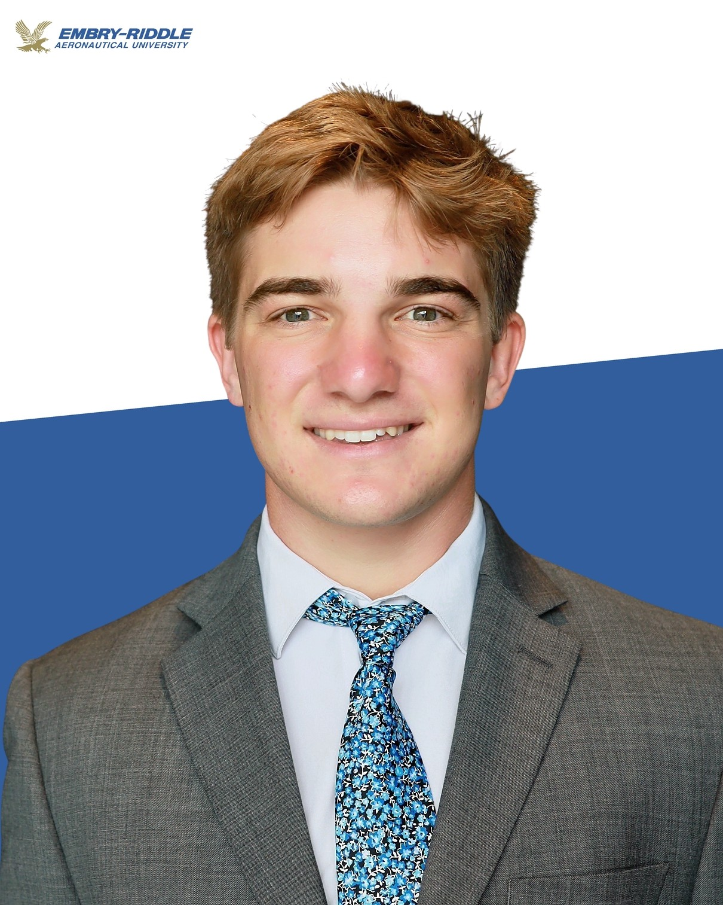
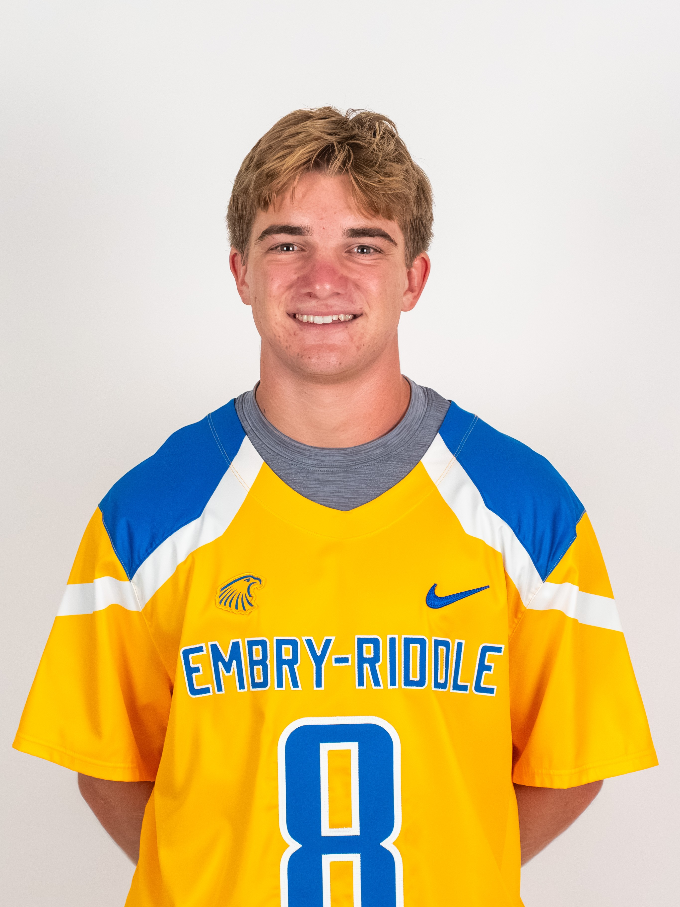

[Home](index.md) | [Projects](projects.md) | [About](about.md) | [Resume](resume.pdf)

# About Me

  

I am a Mechanical Engineering student at Embry-Riddle Aeronautical University with a concentration in Robotics and Automation. My interests lie at the intersection of computational modeling, system integration, and real-world engineering implementation.

Through research with the Multiscale Advection Diffusion Analysis Laboratory (MADAL), I have developed and applied high-performance computational tools for fluid dynamics and numerical modeling. In parallel, my project and industry experiences have involved integrating, testing, and validating complex systems ranging from autonomous vehicles to industrial robotic automation.

---

## Student-Athlete Experience

  

I am also a member of the **NCAA Division II Men’s Lacrosse team at Embry-Riddle**, where I compete as a student-athlete while maintaining a full engineering course load.

Balancing athletics with engineering has strengthened my time management, discipline, teamwork, and ability to perform under pressure—skills that translate directly to collaborative and deadline-driven engineering environments.

**Athletics Profile:**  
[View Embry-Riddle Men's Lacrosse Roster Profile](https://erauathletics.com/sports/mens-lacrosse/roster/carter-groezinger/9777)

---
