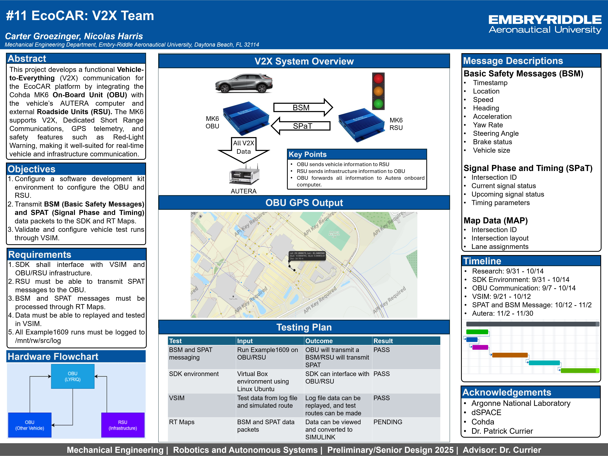

# EcoCAR EV Challenge – V2X Systems Integration

## Project Overview
This project focused on the integration and validation of vehicle-to-vehicle (V2V) and vehicle-to-infrastructure (V2I) communication systems as part of the EcoCAR EV Challenge. The work involved configuring onboard communication hardware, developing supporting software, and testing system performance in simulated and real vehicle environments.

The goal was to enable reliable transmission of live vehicle data to support connected and autonomous vehicle functionality.

---

## Project Context
EcoCAR is a multi-year, DOE-sponsored engineering competition in which university teams design, build, and validate advanced electric vehicle technologies. The Connected and Autonomous Vehicle Systems (CAVS) subteam is responsible for communication, sensing, and data flow between vehicle subsystems and external entities.

Within this effort, V2X communication serves as a critical link between perception, decision-making, and cooperative vehicle behavior.

---

## My Role
I served as **V2X / Team Lead for Connected and Autonomous Vehicle Systems (CAVS)**. My responsibilities included:

- Planning and coordinating system integration activities  
- Configuring V2X communication hardware and software  
- Supporting testing and validation efforts  
- Communicating system status and results through technical presentations and posters  

---

## System Architecture
The V2X system consisted of onboard communication hardware integrated with the vehicle network and supported by Linux-based software for message handling and transmission.

Key components included:
- V2X radio hardware  
- Linux-based computing platform  
- Ethernet interfaces for vehicle data access  
- Software for encoding and broadcasting Basic Safety Messages  

---

## Integration and Testing Approach
System validation followed a progressive testing strategy:

- **Software-in-the-Loop (SIL):**  
  Initial development and validation of message handling and network communication in a simulated environment.

- **Hardware-in-the-Loop (HIL):**  
  Integration of V2X hardware with vehicle subsystems to verify communication reliability and data integrity.

- **Vehicle-in-the-Loop (VIL):**  
  Full vehicle testing to confirm real-time message transmission and system robustness under operational conditions.

This approach allowed issues to be identified early and resolved before vehicle-level deployment.

---

## Tools & Technologies
- Linux  
- C++  
- Networking and communication protocols  
- Vehicle communication standards (BSMs)  
- System integration and validation workflows  

---

## Results
- Successfully integrated V2V and V2I communication capabilities into the EcoCAR vehicle  
- Verified reliable transmission and receiving of data packets  
- Demonstrated system functionality through testing and poster presentations  
- Contributed to overall system readiness for vehicle-level operation  

---

## Visuals

*Poster summarizing V2X system architecture, integration approach, and validation results.*

---

## Takeaways
- Gained hands-on experience integrating hardware and software in a vehicle environment  
- Developed a structured approach to system testing and validation  
- Strengthened technical communication skills through team leadership and presentations  
- Learned to manage real-world constraints such as timing, interfaces, and system dependencies  
