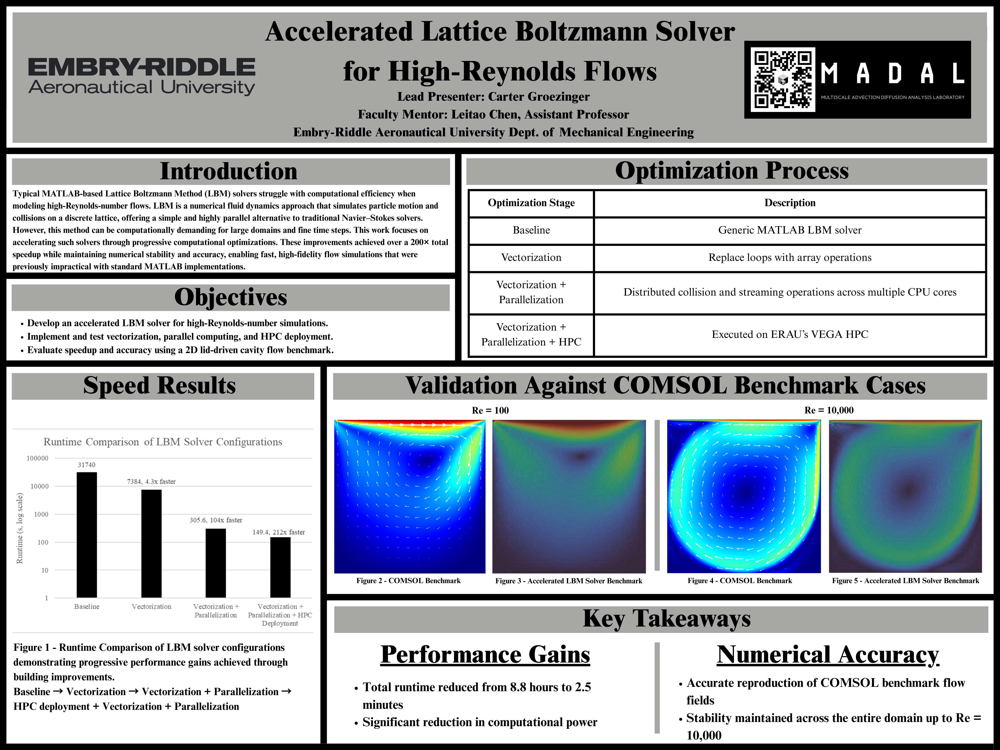

[Home](index.md) | [Projects](projects.md) | [About](about.md) | [Resume](resume.pdf)

# Accelerated Lattice Boltzmann Solver for High-Reynolds Flows

## Overview
This project focused on the development and optimization of an accelerated Lattice Boltzmann Method (LBM) solver for high-Reynolds-number flow simulations. The goal was to improve numerical stability and computational efficiency while maintaining physical fidelity for complex flow problems.

## Project Poster Overview

*Poster presented at Embry-Riddle Aeronautical University summarizing solver optimization, performance gains, and validation against benchmark cases.*

## Motivation
Traditional CFD approaches can become computationally expensive when resolving high-Reynolds flows, particularly when fine spatial resolution is required. LBM offers an alternative formulation with favorable parallelization characteristics, making it well suited for GPU acceleration.

## Approach
- Investigated solver behavior at elevated Reynolds numbers  
- Optimized LBM parameters to improve numerical stability  
- Leveraged GPU acceleration using the FluidX3D framework  
- Benchmarked solver performance against CPU-based approaches  

## Tools & Technologies
- Lattice Boltzmann Method (LBM)
- GPU acceleration
- High-performance computing environments
- ParaView for visualization

## Outcomes
- Achieved substantial performance improvements compared to CPU-based solvers  
- Enabled high-resolution simulations at reduced computational cost  
- Established a stable solver configuration for downstream applied research  

